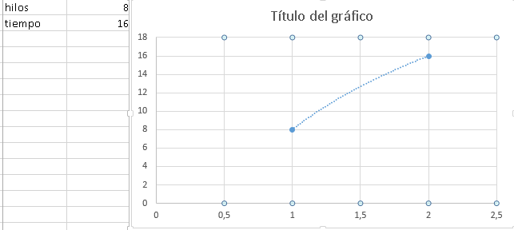

# Lab3 

# Part I - Introduction to threads in JAVA
 Start the three threads with start() 

Start the three threads with run()

At the moment of executing with strar() the results come out in disorder, while they execute with run() the numbers come out in order. this is because the run() function uses the .sleep command

# Part II - Black List Search Exercise
A class is created for the threads that in this case is the class Servidores.

# Part III - Discussion

# Part IV - Performance Evaluation

* a single thread: 

Amdahls law

* 4 threads(number of cores in my computer):

Amdahls law

* 8 threads:

Amdahls law

* 50 threads:

Amdahls law

* 100 threads:

Amdahls law

